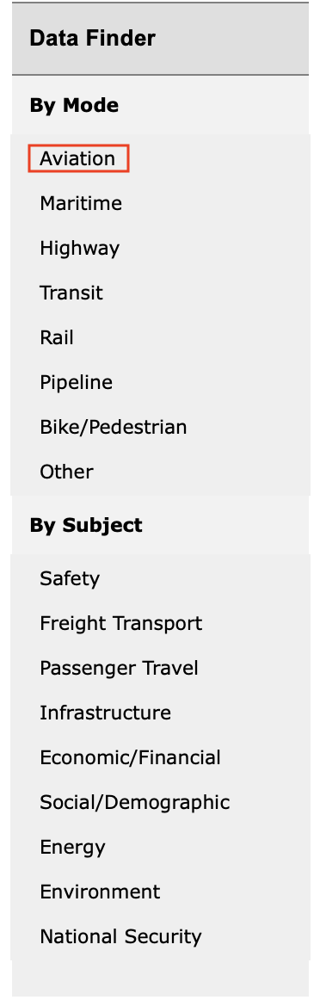
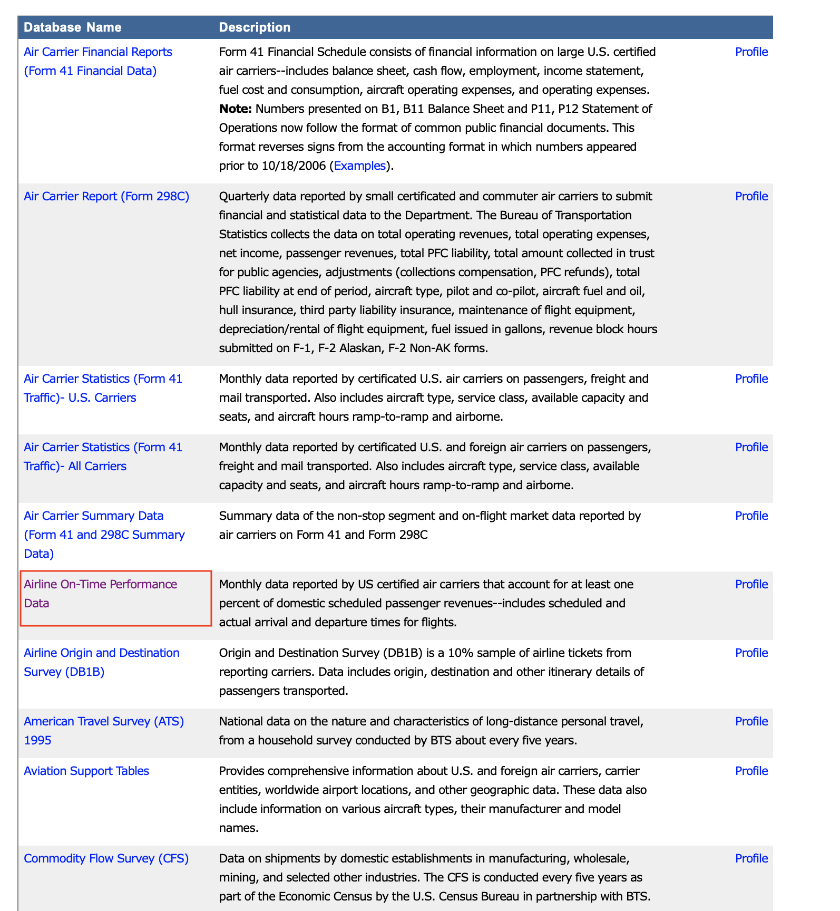
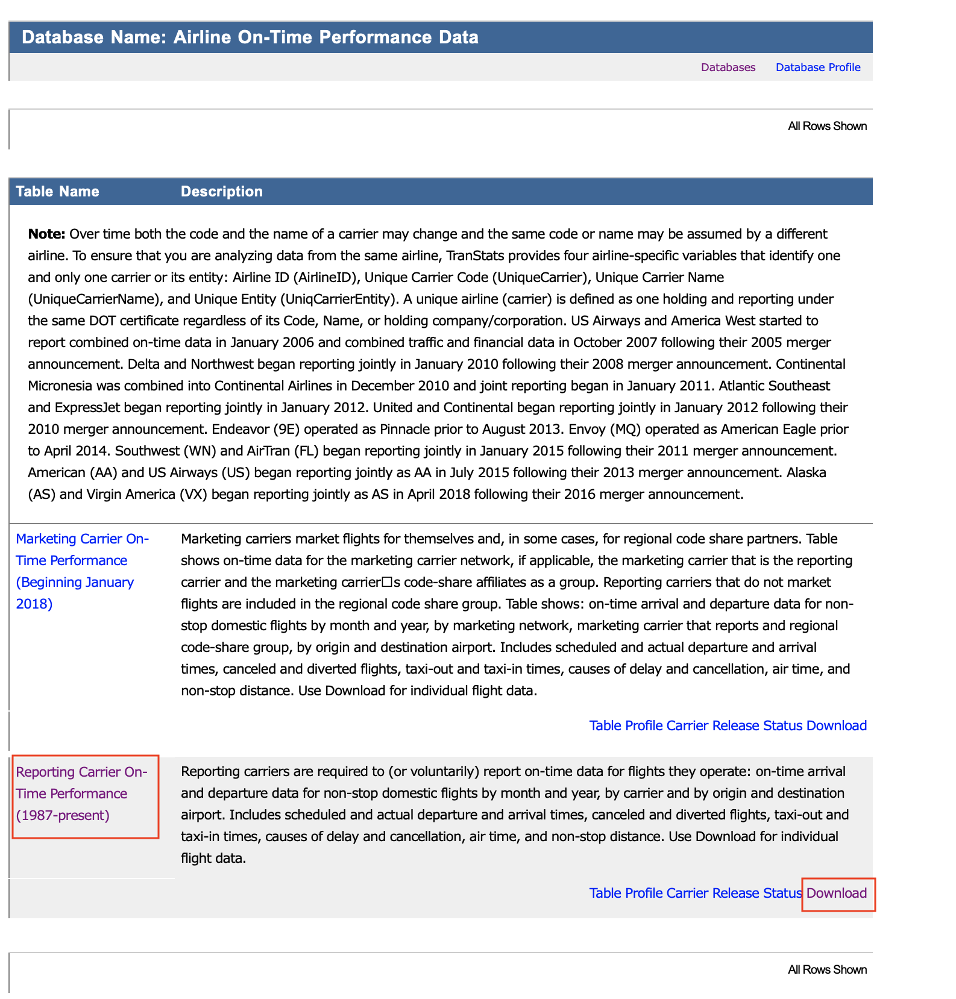
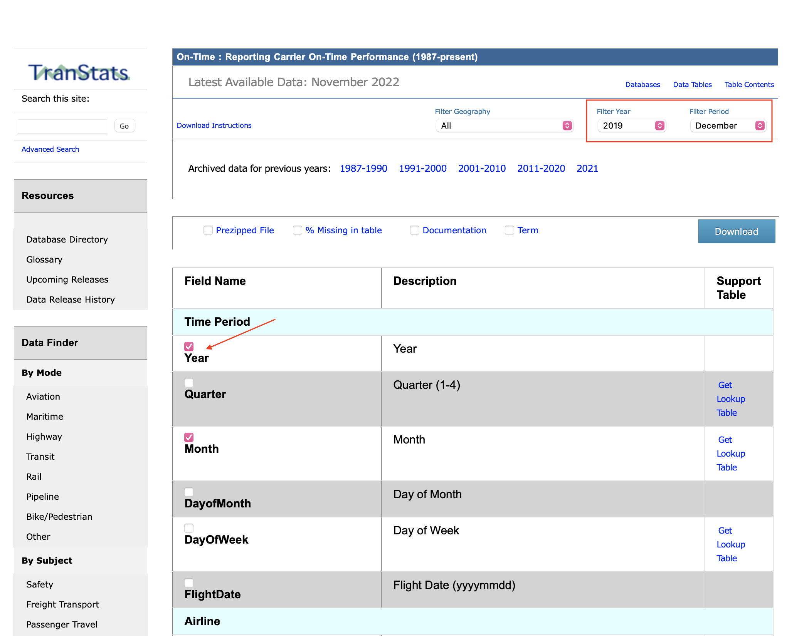

```{r setup, include=FALSE}
knitr::opts_chunk$set(echo = TRUE, 
                      eval = FALSE, 
                      cache = FALSE, 
                      warning = FALSE, 
                      message = FALSE)
options(width=80, digits=3)
```


# 1. Source of data `r emo::ji("information")`

The data for the current study was sourced from the __Bureau of Transportation Statistics__ website which is regulated by __The US Department of Transportation__ and can be accessed through this [link to the dataset](https://transtats.bts.gov/DL_SelectFields.aspx?gnoyr_VQ=FGJ&QO_fu146_anzr=b0-gvzr). 

# 2. Usage permission `r emo::ji("warning")`

The governing body of transportation for the US which is the Department of Transportation (USDOT) manages the usage policies for the publicly available data as cited through the link in the above section.

While there are __no specific licenses attributed__ to the current usage of the publicly available [dataset](https://transtats.bts.gov/DL_SelectFields.aspx?gnoyr_VQ=FGJ&QO_fu146_anzr=b0-gvzr), DOT however encourages the use of the available data with a __CC-BY__ attribution license. The CC-BY license lets us distribute, remix, tweak, and build upon our work, even commercially, as long as we credit the original creation.The license can be looked into further detail through the [link to licensing details](https://ntl.bts.gov/ntl/public-access/managing-rights).

# 3. Data retrieval `r emo::ji("wrench")`

## a) Data download procedure

The process for obtaining the dataset and storing them in an RDatabase file is as follows:

1. The dataset is publicly available in the Bureau of Transpotation Statistics website and can be accessed [here](https://www.transtats.bts.gov).

2. Click on "Aviation" as highlighted in the image below.



3. Once we have been redirected to the "Aviation" section, we need to select the [Airline On-Time Performance Data](https://www.transtats.bts.gov/Tables.asp?QO_VQ=EFD&QO_anzr=Nv4yv0r%FDb0-gvzr%FDcr4s14zn0pr%FDQn6n&QO_fu146_anzr=b0-gvzr) as shown in the image below.



4. Click on the "Reporting Carrier On-Time Performance (1987-present)" to access the desired dataset. Alternatively, we can directly redirect the page to the data selection webpage for this current dataset by clicking the "Download" button below the description of the dataset as shown in the image below.



5. Upon being directed to the download section of the dataset, we are now required to choose the timeline of the dataset. This can be filtered through the top right section of the page as shown by the __<span style="color: red;">red box</span>__ in the below image. We are additionally required to choose the variables that are of importance for us in the current study by clicking on the tick boxes against the variable name as shown by the __<span style="color: red;">red arrow</span>__ in the image below.

Once the variables have been selected for the desired timeline, we need to click on the  __<span style="color: blue;">blue "Download" button</span>__ button to obtain the .csv file in our local hard drive. 




## b) Data saving procedure

The data downloaded from the source through the above process mentioned in the previous section is obtained as a __".csv"__ file. However, the same needs to be saved as a __"Rdatabase file (.Rda)"__. The Rdatabase file stores the dataframe directly. We can write the data from the .csv to .rda file using the __"Save"__ function and load the same in an R session using the __"load"__ function.

The code for saving the dataset in the .Rda file is shown through the code below.

```{r save-file-procedure,echo=TRUE}

df_19<- read.csv('data/T_ONTIME_REPORTING.csv') # Assigning the data from the .csv file to a dataframe named "df_19" 
save(df_19,file= 'data/airports.rda')  # Saving the file as a .rda file

```
To get started with reading the data, we can use the following r-code chunk :

```{r data-load-from-rda }
library(tidyverse)
library(emo)
load(here::here("data/airports.rda")) #Loading the data into a R session
```

## c) Data processing

Once the data has been read, we need to process the data to create a subset of the large dataset that will be required to create the final analysis. This would require us to filter some of the relevant parts of the initial dataset. Some of the steps for data processing are as follows :

1. Since we are concerned with the airports of __SEA__ and __LAS__ only, hence we will filter the dataset to contain these two airports in the Origin variable only. This will help us analyse the onward connections available from either of the SEA or LAS airports. The following R code chunk will help us filter the data.

```{r filter-data}

df_SEA_las <- df_19 %>% filter(ORIGIN %in% c('SEA','LAS')) #Filtering dataframe containing "SEA" and "LAS" as the origin airports.

```

2. Upon looking into the departure and arrival delay data, we can observe that some of the departure and arrival delays are greater than the time period of a full day. Maximum departure delay recorded was 1697 minutes while that of arrival delay was 1701 minutes. Additionally, these excessively delayed flights did not raise the "CANCELLED" flag. These values seem to be unrealistic as a flight is unlikely to be delayed by more than 24 hours and yet not be cancelled. To take care of these outliers, we can limit the departure and arrival delays to 12 hours (720 minutes) or lower. The following R code chunk limits the delay minutes.

```{r delay-limit}

df_SEA_las <- df_SEA_las %>% filter(DEP_DELAY <=720 | ARR_DELAY <=720)  #Filtering data with departure delay and arrival delay less than or equal to 720 minutes.

```


# 4. Data description `r emo::ji("book")`

## a) Variables

The data is in the file `airports.rda` in the `data` directory. It contains these variables:

- __DAY_OF_WEEK__ : Which day of the week did the flight takeoff
- __FL_DATE__ : Date of travel (YYYY/MM/DD)
- __OP_UNIQUE_CARRIER__ : Carrier ID to identify the airline
- __ORIGIN__ : Takeoff airport code 
- __ORIGIN_CITY_NAME__ : Takeoff city name
- __ORIGIN_STATE_ABR__ : Takeoff state name
- __DEST__: Landing airport code 
- __DEST_CITY_NAME__ : Landing airport city
- __DEST_STATE_ABR__ : Landing airport state
- __DEP_TIME__ : Departure time of flight in local time (hh:mm)
- __DEP_DELAY__ : Any delay in departure recorded (minutes)
- __ARR_TIME__ : Arrival time of the flight in local time (hh:mm)
- __ARR_DELAY__ : Any delay in arrival recorded (minutes)
- __CANCELLED__ : Whether flight was cancelled
- __DIVERTED__ : Whether flight was diverted to the airport
- __FLIGHTS__ : Number of flights
- __CARRIER_DELAY__ : Any delay recorded due to carrier operations.(minutes)
- __WEATHER_DELAY__ : Any delay recorded due to weather conditions. (minutes)

## b) Summary of the dataset

### b.1) Time period of data

The current dataset contains all the US carrier flight details for the month of December, 2019 across all the airports in the country.The reason for choosing this timeline is as follows :

- December has historically been the busiest part of the year for all airports due to the holiday season. In order to extend another connectivity within the US, it will be beneficial to choose the airport which provides for the maximum number of connections to other parts of the country during the times of peak passenger footfall in the airports.

- As the aviation industry was hit drastically by the COVID-19 pandemic during the years 2020-2021, hence, the study mainly focuses on the pre-pandemic period (2019) when the airline traffic and passenger behavior were not altered by the lockdowns and restrictions.


### b.2) Population of the dataset

The population of the raw dataset downloaded from the Bureau of Transportation Statistics contain all the flights undertaken by the various domestic US airline carriers in the month of December 2019.The dataset contains information of the carrier ID, airports, cities and states traveled to as well as the duration of each flight along with any delays encountered. 

Since the filtered dataset is of a timeline of one month, the sample __may not be considered as a representation of the entire dataset__ as there are a multitude of factors that can __affect the operations of the airline aswell as the passenger behaviour throughout the year__. Hence, the results for a particular month may be heavily biased when compared for a sample with another month's data.

### b.3) Selection of variables for the dataset

The reason for the selection of the variables for the current dataset have been delineated as follows :

1. __DAY_OF_WEEK__ : This variable would help us understand whether the airports are especially busy on certain days of the week. We can decide which would be the most ideal day/days in the week where passengers would likely fly to either of the airports (SEA or LAS) as final destinations or for further connections. 

2. __FL_DATE__ : This variable provides us the exact date of flight travel. It can help us aggregate the various number of flight connections on different days of the month. Aggregating the flights through a visualisation such as a barplot may help us understand whether the connections have increased, decreased or remained constant throughout the month.

3. __OP_UNIQUE_CARRIER__ : This variable will help us identify the airline carrier which is completing a particular trip. We can use this variable to understand which carriers are the most active and travel to major as well as the regional airports of the US from SEA and LAS.

4. __ORIGIN__ : This variable indicates the point of initiation of a flight trip. In particular, this variable provides us with the takeoff airport.

5. __ORIGIN_CITY_NAME__ : This variable indicates the city where the takeoff airport is situated in. We can use this variable to understand the popular flight connections in the US.

6. __ORIGIN_STATE_ABR__ : This variable indicates the state where the takeoff airport is situated in. We can use this variable to understand the popular flight connections in the US.

7. __DEST__ : This variable indicates the termination of the flight. In particular, this variable provides us with the landing airport.

8. __DEST_CITY_NAME__ : This variable indicates the city where the landing airport is situated in. We can use this variable to understand the popular flight connections in the US.

9. __DEST_STATE_ABR__ : This variable indicates the state where the landing airport is situated in. We can use this variable to understand the popular flight connections in the US.

10. __DEP_TIME__ : This variable indicates the time of departure for a flight. We can understand the most common hours of flight travel in a day. This would additionally help us schedule the connections of Qantas to SEA or LAS such that the passengers have as many options to avail any onward connections to other states.

11. __DEP_DELAY__ : This variable indicates the delay of departure of flights in minutes. We can compare which airport amongst SEA and LAS suffer from high delays. Delays are to be avoided as they impact the operations of the airline carrier negatively.

12. __ARR_TIME__ : This variable indicates the time of arrival for a flight. We can understand the most common hours of flight landing in a day. This would additionally help us schedule the connections of Qantas to SEA or LAS such that the passengers have as many options to avail any onward connections to other states.

13. __ARR_DELAY__ : This variable indicates the delay of departure of flights in minutes. We can compare which airport among SEA and LAS suffer from high delays. These delays could indicate the traffic congestion that might occur in either of the airports and can be avoided.

14. __CANCELLED__ : This variable indicates whether any of the connections were cancelled at the respective airports. Airports with high cancellations should be avoided.

15. __FLIGHTS__ : This variable indicates the number of flights inbound and outbound. This will help us understand the level of activity in SEA or LAS.

16. __CARRIER_DELAY__ : This variable indicates whether a delay occurred as a result of the operations of the airline carrier. Airports reporting high carrier delays would not be favourable for passengers to choose an onward connection to another state.

17. __WEATHER_DELAY__ : This variable indicates the minutes of delay as a result of weather. This could be an important variable to look into as December reports inclement weather in the US and could affect the airline operations. Hence, the effects of weather for each airport has to be studied to decide on the choice of SEA or LAS as the new connection for QANTAS.


# 5. Limitations of the data `r emo::ji("circle")`

While the data collection has been done in an extensive and granular manner with multitudes of information available, some of the limitations that have been observed are as follows :

a) The arrival and departure times are not recorded as time stamps. As a result, it is difficult to interpret the data. Moreover, since these times are recorded as per the local airport timezone, it is not possible to readily use this data for mathematical operations such as subtraction to calculate the flight duration.

b) In order to create any temporal analysis, it is important to convert the timezones into a standard timezone for all the observations. Currently, the timestamps vary based on the regional airport timezone.

c) Moreover, if the departure time and arrival times are from different days, the subtraction will show an incorrect flight duration.

d) Some of the delays recorded as Arrival and Departure delays are greater than a full day. This is unlikely to be an actual scenario and may bias the analysis.

e) The dataset here is an __observational data__ and in particular, a census data. Some of the limitations that are prevalent in such datasets are as follows :
     - The data here is obtained from various sources (in particular, the various carrier airlines). As a result, there may be non-uniformity in the data provided        as each airline may have their own interpretations of the data they may have provided.
     - The current dataset obtained is a subset of an observational data. These types of data are often plagued with lack of randomisation during the selection of        data. This may lead to biases in the dataset such as selection and systematic bias.
     - The data maybe mis-classified or filled in non-uniform units by the various sources, leading to lack of accuracy of the overall dataset.
     


__________________________________ __End of file__ ____________________________________


