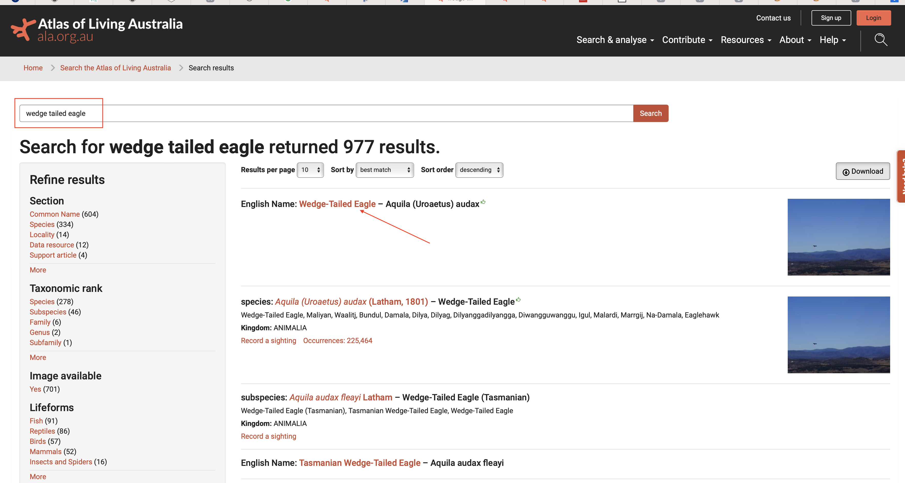
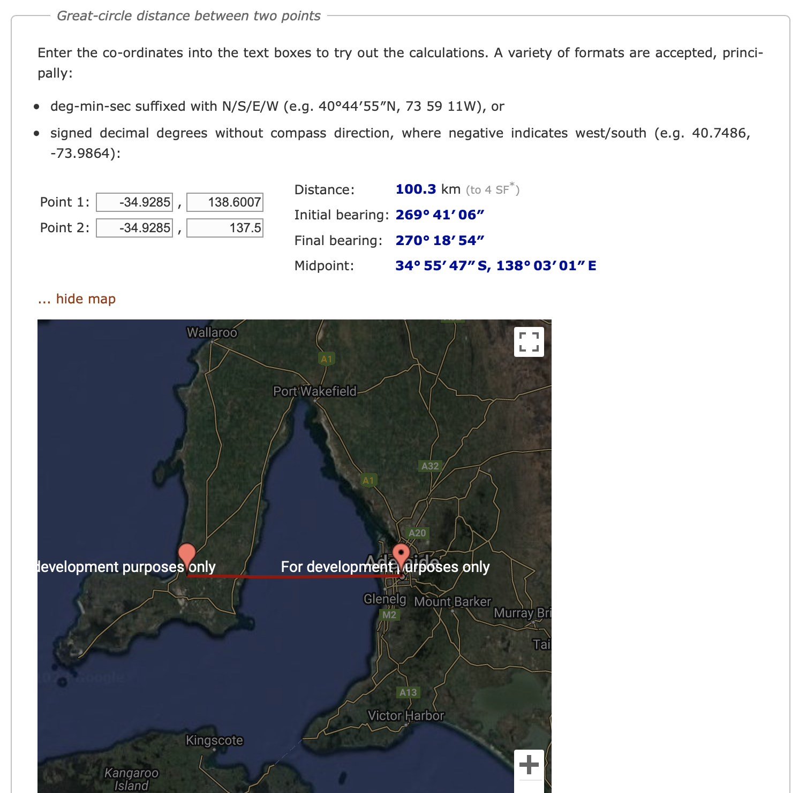
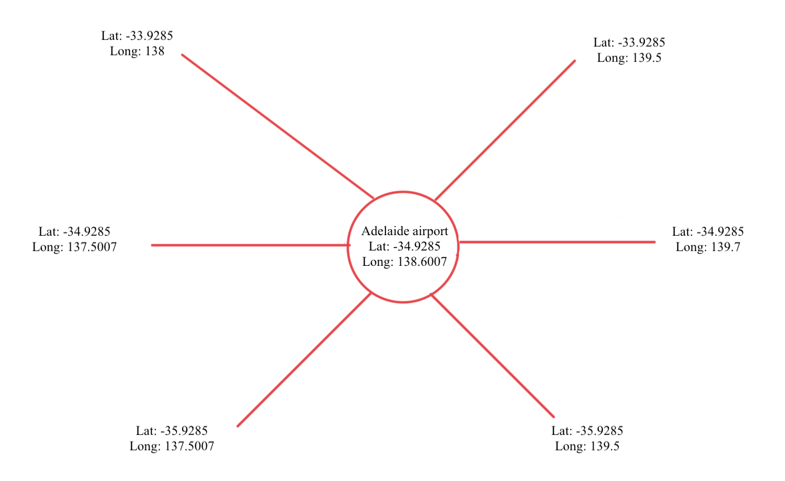

```{r setup, include=FALSE}
knitr::opts_chunk$set(echo = TRUE)
```

```{r library, include=FALSE,echo=FALSE}
library(tidyverse)
```


# 1. Source of data `r emo::ji("information")`

The data for the current study was sourced from the __Atlas of Living Australia__ [website](https://www.ala.org.au) which is an open data source supported by __The Australian Government and is hosted by Commonwealth Scientific and Industrial Research Organisation (CSIRO)__. The data for occurrences of wedge-tailed eagles (Aquila (Uroaetus) audax) across Australia can be accessed through this [link to the dataset](https://bie.ala.org.au/species/https://biodiversity.org.au/afd/taxa/23e2ccef-06b0-4749-abc6-d8a710b94f69). 

# 2. Usage permission `r emo::ji("warning")`

The Atlas of Living Australia is an open data repository for all the information on the bio-diversity of Australia, supported by the Australian Government through the  National Collaborative Research Infrastructure Strategy (NCRIS) and is hosted by The Australian Government and is hosted by Commonwealth Scientific and Industrial Research Organisation (CSIRO).

The current usage of the publicly available [dataset](https://bie.ala.org.au/species/https://biodiversity.org.au/afd/taxa/23e2ccef-06b0-4749-abc6-d8a710b94f69) is available for use through a __CC-BY__ attribution license. This particular license allows us to reuse, replicate, tweak and reproduce the data as long as we cite the original source of the data. The license can be looked into further detail through the [link to licensing details](https://www.ala.org.au/terms-of-use/#cy).

# 3. Data retrieval `r emo::ji("wrench")`

## a) Data download procedure

The process for obtaining the dataset and storing them in an RDatabase file is as follows:

1. The dataset is publicly available in the Atlas of Living Austrlia (ALA) [website](https://www.ala.org.au).

2. In the search bar, we need to type in __"Wedge tailed eagle"__ which will return us the available data with the scientific name of the bird. The keyword for obtaining the data is to use the scientific name for wedge tailed eagle which is __"Aquila (Uroaetus) audax"__. The step is shown through the image below for reference. The __<span style="color: red;">red box</span>__ shows the keyword entered in the search bar while the __<span style="color: red;">red arrow</span>__ shows the link to the dataset used for the current study.



3. The data retrieval is done through the  use of the __"Galah"__ library on R. The Galah library allows us to download species occurrence records, taxonomic information, sounds and images by restricting the queries to certain locations using the Latitude and Longitude values. A detailed description of the package along with the installation process may be accessed [here](https://galah.ala.org.au).

Once the Galah library has been installed and setup in the R Studio environment, the following code is run to obtain the required dataframe. To limit the size of the dataframe being queried, the following filters are applied to answer the questions outlined by the task.

1. Data dating back to 1st January, 2000 have been queried.
2. Taxonomic name of __"Aquila (Uroaetus) audax"__ was used to obtain results exclusively for the occurrences of wedge tailed eagles across regions in Australia.
3. __Latitude, Longitude, eventDate__, __dataResourceName__ and __occurenceStatus__ variables were queried.


```{r data-retrieval, eval=FALSE}
library(galah)
galah_config(email = "abar0090@student.monash.edu",
             download_reason_id = 10, 
             verbose = TRUE)
eagles <- ala_occurrences(
  taxa = select_taxa("Aquila (Uroaetus) audax"))
eagles <- eagles %>% 
  rename(Longitude = decimalLongitude,
         Latitude = decimalLatitude) %>%
  mutate(eventDate = as.Date(eventDate)) %>%
  filter(!is.na(eventDate)) %>%
  filter(!is.na(Longitude)) %>%
  filter(!is.na(Latitude)) %>%
  filter(eventDate>"2000-1-1") %>%        #Filtering data from 1st Jan 2000 to latest data
  dplyr:: select(c(Latitude,Longitude,recordID,eventDate,dataResourceName,occurrenceStatus))  #Selecting relevant variables 
   

head(eagles)

```

## b) Data saving procedure

After the data has been queried successfully and obtained as a dataframe, it is further saved into the Rdatabase file __'eagles.rda'__ using the save function and is shown in the R code chunk below with the appropriate comments.

```{r save-data, eval=FALSE}

save(eagles, file=here::here("data/wte.rda")) #Saving dataframe into eagles.rda 

```
## c) Data processing 

Since the volume of the dataset is considerably large, it is important to process the data in a manner that lets us create a subset of the data which allows for us to obtain the highest information gain without making the analysis very messy or complex. 

It was further decided to obtain the wedge-tailed eagle sightings for all the locations in and around a 100 kilometer radius. For this purpose, a resource for calculating the distance between two sets of latitude and longitudes were used. The distance calculator can be accessed [here](http://www.movable-type.co.uk/scripts/latlong.html). An image of the interface of the distance calculator is shown in the image below.



Using the above calculator, a set of 6 latitudes and longitudes around a distance of approximately 100 kms from the Adelaide and Longreach airports were obtained. The image below shows the 6 geolocation points around the Adelaide airport for reference.



From the above image, it can be observed that the locations within a 100 km radius for each of the airports can be obtained by creating a range of __+/- 1 degree__ of the latitudes and longitudes of each of the airport locations. Hence, we can apply the filter function of dplyr library to create the subset of the necessary locations from which, the presence of the eagles can be obtained.

```{r filter-lat-long-adelaide, eval=FALSE}

# Adelaide airport

eagles_ade <- eagles %>% filter(Latitude >= -35.9285) %>% filter(Latitude <= -33.9285) #Filtering latitudes

eagles_ade <- eagles_ade %>% filter(Longitude >= 137.5) %>% filter(Longitude <= 139.5) #Filtering longitudes 


head(eagles_ade)
```
```{r filter-lat-long-longreach, eval=FALSE}

# Longreach airport

eagles_lon <- eagles %>% filter(Latitude <= -22.4403) %>% filter(Latitude >= -24.4403) #Filtering latitudes

eagles_lon <- eagles_lon%>% filter(Longitude >= 143.2506) %>% filter(Longitude <= 145.2506) #Filtering longitudes 


head(eagles_lon)
```

# 4. Data description `r emo::ji("book")`

## a) Variables

The data is in the file `eagles.rda` in the `data` directory. It contains these variables:

- __Latitude__ : Latitude value of the record obtained.
- __Longitude__ : Longitude value of the record obtained.
- __recordID__ : A unique identifier for each observation obtained.
- __eventDate__ : Date on which the observation was recorded.
- __dataResourceName__ : This variable helps us identify the source of the data.
- __occurenceStatus__ : An indicator to mark whether the wedge-tailed eagle was spotted for the corresponding latitude and longitude on the particular event date.

## b) Summary of the dataset

### (b.1) Time period of data

The current dataset contains all the occurrences of wedge-tailed eagles across Australia with latitude and longitude values from 1st January 2000 to the latest updated data records.

### (b.2) Population of the dataset

The population of the dataset obtained from ALA website provides us with all the records of presence (or absence) of the wedge-tailed eagle for the corresponding latitude and longitude. This dataset of spatial variables would help us understand the population density of the bird in and around the airports of Adelaide and Longreach. Since we are required to assess the chances of bird strikes around these airports, hence, we create the population of the dataset in a manner such that we obtain the presence of the wedge-tailed eagle around 100 kms of these airports by creating a filtered dataset. As we have retrieved the data for the filtered locations __for a considerable timeline__, hence, the population of the sample dataset __is expected to be a representative dataset for the entire population__ that was obtained from the ALA website.

### (b.3) Selection of variables for the dataset

The reason for the selection of the variables for the current dataset have been delineated as follows :

1. __Latitude__ : This is one of the spatial variables that will help us pin point a geographical location where a record for the presence (or absence) of the wedge-tailed eagle was observed.

2. __Longitude__ : This is one of the spatial variables that will help us pin point a geographical location where a record for the presence (or absence) of the wedge-tailed eagle was observed.

3. __recordID__ : Helps us identify the number of unique observations of birds reported for a particular location and event date.

4. __eventDate__ : This is the date on which, the record was obtained. A temporal analysis can be performed using this variable as it would help us understand whether the presence of the bird has risen or dropped over the years in the locations close to the airports of Adelaide and Longreach.

5. __dataResourceName__ : This variable helps us understand the source of the data. This could be an important factor while basing our analysis as Atlas of Living Austrlia conducts regular data quality checks. If at any point, the license of a data resource provide is revoked due to quality concerns, we can identify which observations to filter out from the data at a later point. ALA's data quality project can be referred through the [link here](https://support.ala.org.au/support/solutions/articles/6000232279-the-ala-s-data-quality-project).

6. __occurenceStatus__ : Whether the record obtained for the particular geographical location on a given date observed the presence or absence of the wedge-tailed eagle.

# 5. Limitations of the data `r emo::ji("circle")`

a) Since the data obtained from ALA falls under the category of observational data, there could be instances of missing values. These have been filtered out while retrieving the data from the repository.

b) Since the data is obtained from various sources, there could be inconsistencies in reporting the data.

c) While the data collection was done in an extensive and granular manner, there could be a lack of precision of the observations made for the exact latitude and longitude.

d) The dataset obtained from the Atlas of Living Australia only reports for all the wedge-tailed eagles that have been recorded. Hence, it does not report the entire population of these eagles across the selected regions of Australia. 


e) The dataset here is an __observational data__ and in particular, occurences data. Some of the limitations that are prevalent in such datasets are as follows :
     - The data here is obtained from various sources (in particular, the various carrier airlines). As a result, there may be non-uniformity in the data provided        as each airline may have their own interpretations of the data they may have provided.
     - The current dataset obtained is a subset of an observational data. These types of data are often plagued with lack of randomisation during the selection of        data. This may lead to biases in the dataset such as selection and systematic bias.
     - The data maybe mis-classified or filled in non-uniform units by the various sources, leading to lack of accuracy of the overall dataset.


__________________________________ __End of file__ ____________________________________


